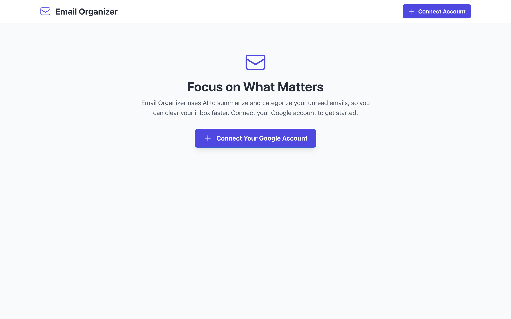
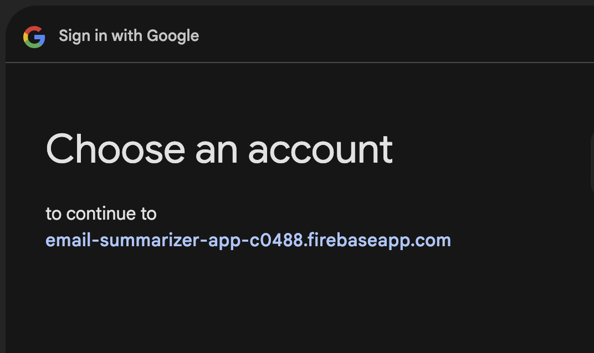
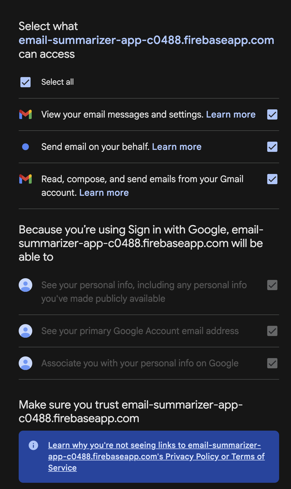
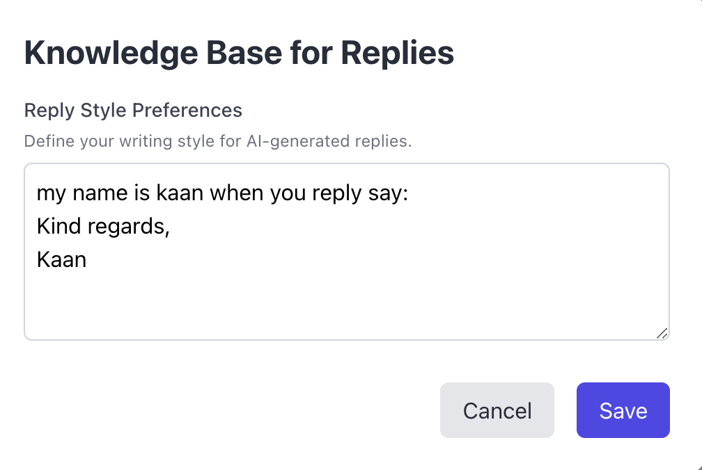
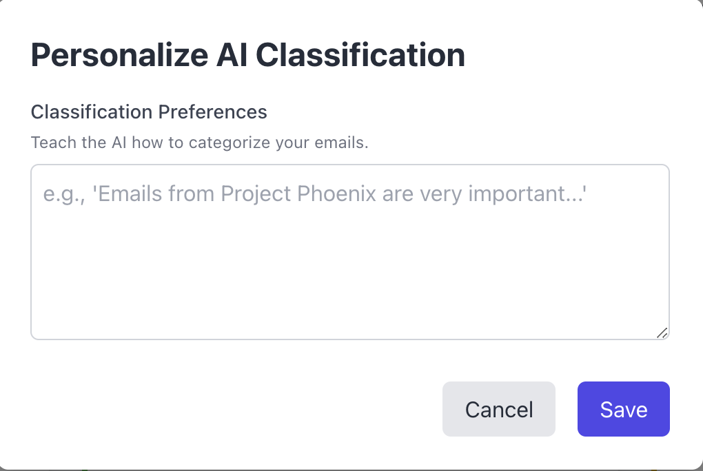

# Email Organizer

**Email Organizer** is an AI powered application that helps the way you manage your inbox by summarizing and categorizing your unread Gmail messages, and helping you in crafting replies.

## Overview
In today's fast-paced world, an overflowing email inbox can be a significant source of stress and lost productivity.
- **Email Information** leverages the power of LLMs to process your unread emails.
- **Get the Overview as quick as Possible:** Receive concise, AI-generated summaries of lengthy emails.
- **Intelligent Prioritization:** Automatically classify emails into customizable categories like *Very Important*, *Important*, *Non-Important*, *Promotions*, and *Spam*, ensuring you focus on what truly matters.
- **Effortless Replies:** Generate smart, context-aware according to the context you provide reply drafts based on your specific instructions and personalized writing style, saving you a lot of time.

---

## User Interface

Here are screenshots showcasing the intuitive design and layout of the Email Organizer:

<p align="center">
  
  <br><br>
  
  <br><br>
  
  <br><br>
  
  <br><br>
  
</p>

---

## Technologies Used
**Frontend:**
- React
- CSS

**Backend/APIs:**
- Google Gmail API
- OpenAI API
- Firebase Authentication
- Firebase Firestore

---

## Getting Started
Follow these steps to set up and run the **Email Insight** application locally.

### Prerequisites
- Node.js (LTS version recommended): [Download Here](https://nodejs.org)
- npm (comes with Node.js) or Yarn

---

### 1. Clone the Repository
```bash
git clone https://github.com/kaan7305/email-organizer.git
cd email-summarizer-app
```

(Replace `kaan7305` with your actual GitHub username)

---

### 2. Install Dependencies
```bash
npm install
# or if you use yarn
yarn install
```

---

### 3. Environment Variables Setup (Crucial!)
Create a `.env` file in the root of your project:
```
REACT_APP_FIREBASE_API_KEY=YOUR_FIREBASE_API_KEY
REACT_APP_FIREBASE_AUTH_DOMAIN=YOUR_FIREBASE_AUTH_DOMAIN
REACT_APP_FIREBASE_PROJECT_ID=YOUR_FIREBASE_PROJECT_ID
REACT_APP_FIREBASE_STORAGE_BUCKET=YOUR_FIREBASE_STORAGE_BUCKET
REACT_APP_FIREBASE_MESSAGING_SENDER_ID=YOUR_FIREBASE_MESSAGING_SENDER_ID
REACT_APP_FIREBASE_APP_ID=YOUR_FIREBASE_APP_ID
REACT_APP_OPENAI_API_KEY=YOUR_OPENAI_API_KEY
```

---

### 4. Run the Application
```bash
npm start
# or
yarn start
```

Visit [http://localhost:3000](http://localhost:3000)

---

## Usage
1. **Connect Your Google Account** - Authenticate via Google OAuth.
2. **View Summarized Emails** - AI summaries and categorized emails.
3. **Personalize AI Classification** - Customize how AI categorizes your emails.
4. **Define Reply Knowledge Base** - Set your tone, common phrases, and sign-offs.
5. **Reply with AI Assistance** - Generate and edit replies before sending.
6. **Mark as Read** - Keep your inbox clean.

---


## Contact
- **GitHub:** (https://github.com/kaan7305)
- **Linkedin:** ([https://github.com/kaan7305/email-organizer](https://www.linkedin.com/in/kaan-eroltu-057b79218/))
